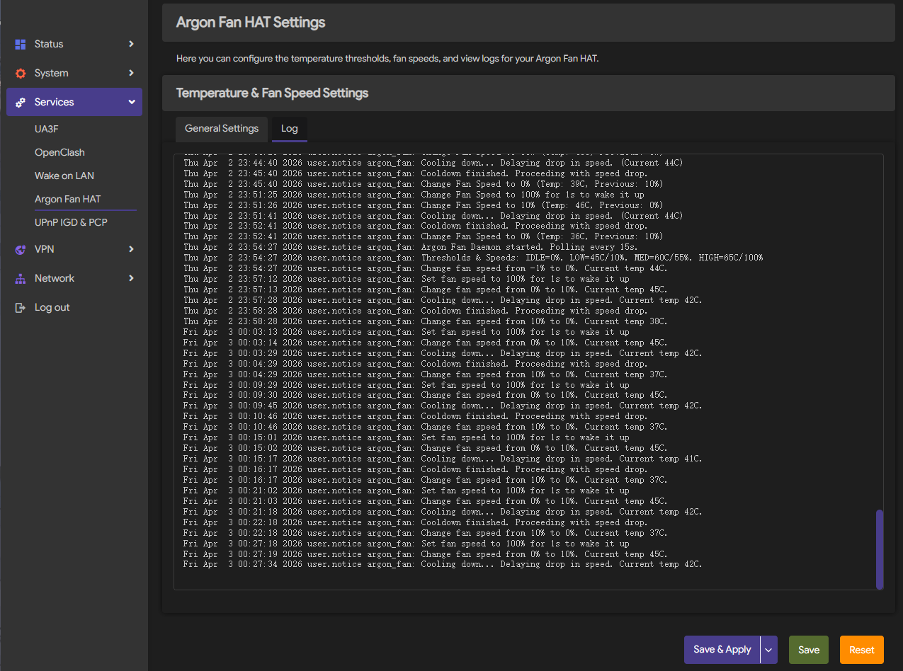

# OpenWrt Argon Fan HAT

Language: English | [简体中文](README.zh-CN.md)

**Note: a large portion of this project was generated with AI assistance. The code has been reviewed, tuned, and tested on real hardware, but if that is a concern, please do not use this project.**

This project provides an OpenWrt adaptation of the Argon Fan HAT control logic. The original script has been rewritten as native OpenWrt packages with unnecessary parts removed, giving you a long-running fan daemon and a LuCI configuration page for Raspberry Pi devices running OpenWrt.

## Showcase

<details open>
<summary>Click to collapse / expand</summary>

Note: the screenshots below were taken with project version v0.1.1-r1, `luci-theme-argon` v2.4.3, and ImmortalWrt 24.10.3, with custom default settings applied.
Please treat them as reference only and rely on the actual UI after installation.

  


</details>

## Usage

You can download the prebuilt `ipk` files from Releases and install them on your OpenWrt device.

Install the main package first:

```sh
opkg install argon-fan_*.ipk
```

If you want the LuCI web interface, install the following packages as well:

```sh
opkg install luci-app-argon-fan_*.ipk
opkg install luci-i18n-argon-fan-zh-cn_*.ipk
```

If LuCI is available, you can also upload and install the `ipk` files directly from LuCI under `System -> Software`.

After installation, you can tune the settings in LuCI, or edit `/etc/config/argon_fan` directly if you do not use LuCI.

## Features

- Polls CPU temperature and adjusts fan speed according to configured thresholds.
- Falls back to 50% fan speed when the service stops to avoid a sudden loss of cooling.
- Uses OpenWrt `procd` and UCI instead of the desktop-oriented installer and system tweaks from the original script.

## Differences from upstream

This project is intentionally trimmed down compared with the original Argon script set:

- No network-based installer, and no runtime system-wide configuration changes.
- No Raspberry Pi OS desktop shortcuts, EEPROM checks, time-sync helpers, or multi-device menu.
- Only the core Argon Fan HAT features are kept: temperature polling, I2C fan control, service management, and LuCI configuration.
- Extra upstream components such as RTC, OLED, IR, UPS, and BLSTR DAC support are out of scope here.

## Pending Implementation

- [ ] Support for hardware button

## Packages

- `argon-fan`: daemon that controls fan speed over I2C based on CPU temperature.
- `luci-app-argon-fan`: LuCI page for tuning temperature thresholds, fan speeds, and cooldown settings.
- Default configuration file: `/etc/config/argon_fan`.

## Build

This repository provides OpenWrt SDK build scripts. By default, they download and use the OpenWrt 24.10.0 x86_64 SDK.

```sh
./scripts/1-debian-install-deps.sh
./scripts/2-download-sdk.sh
./scripts/3-prepare-build.sh
./scripts/4-build.sh
```

After the build finishes, the generated packages will be available under `dist/`.
