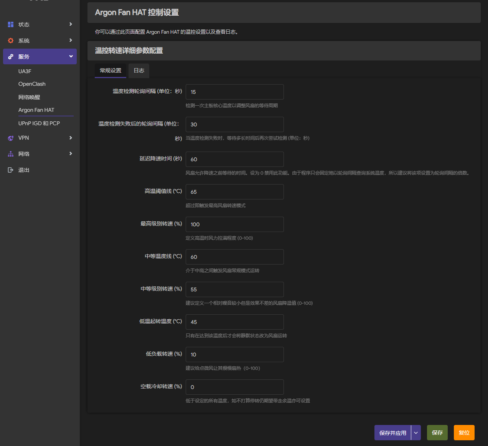
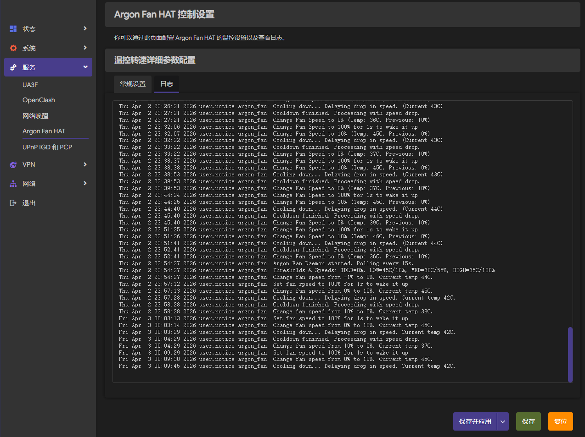

# OpenWrt Argon Fan HAT

**注意：本项目大量代码使用 AI 生成，虽然代码质量由我把控且有实机测试，但如果担心则不建议使用本项目**

这是一个面向 OpenWrt 的 Argon Fan HAT 适配项目。它把原版脚本中 Argon Fan HAT 的控制逻辑重新实现为 OpenWrt 包，对非必要内容进行精简，提供常驻风扇守护进程和 LuCI 配置界面，适合在树莓派上的 OpenWrt 环境中使用。

## 展示

注：以下截图使用项目 v0.1.1-r1 版本、`luci-theme-argon` v2.4.3 与 ImmortalWrt 24.10.3，且我更改过默认设置  
请以实际安装后展示的界面为准

  


## 使用

你可以直接从 Releases 下载已经打包好的 `ipk` 文件并安装到 OpenWrt 设备上。

安装主包（守护进程）：

```sh
opkg install argon-fan_*.ipk
```

如果需要 LuCI 网页控制台页面，请接着安装：

```sh
opkg install luci-app-argon-fan_*.ipk
opkg install luci-i18n-argon-fan-zh-cn_*.ipk
```

如果你正在使用 LuCI，也可以直接在 LuCI 的 `系统 -> 软件包` 界面上传并安装 `ipk` 包。

安装后可在 LuCI 中调整参数，如果你没有使用 LuCI，也可以编辑 `/etc/config/argon_fan`。

## 默认行为

- 轮询 CPU 温度并按阈值调整风扇速度。
- 当风扇服务停止时，会把风扇切回到 50%，避免设备瞬间失冷。
- 采用 OpenWrt 的 `procd` 和 UCI 管理，不依赖原版脚本的桌面环境或系统安装器。

## 差异说明

相比原版，这个项目做了明显精简：

- 不再使用联网下载安装器，也不再在运行时修改大量系统配置。
- 不再包含原版面向 Raspberry Pi OS 的引导、桌面快捷方式、EEPROM 检查、时间校正和多设备菜单。
- 只保留 Argon Fan HAT 需要的核心能力：温度采样、I2C 控风、服务守护和 LuCI 配置。
- 原版包含的 RTC、OLED、IR、UPS、BLSTR DAC 等扩展功能不在本项目范围内。

## 待实现

- [ ] 兼容硬件按钮

## 项目内容

- `argon-fan`：风扇守护进程，按 CPU 温度通过 I2C 控制风扇转速。
- `luci-app-argon-fan`：LuCI 配置页面，可直接调整温度阈值、转速和冷却延迟。
- 默认配置文件位于 `/etc/config/argon_fan`。

## 构建

仓库提供了基于 OpenWrt SDK 的构建脚本，默认下载并使用 OpenWrt 24.10.0 x86_64 SDK。

```sh
./scripts/1-debian-install-deps.sh
./scripts/2-download-sdk.sh
./scripts/3-prepare-build.sh
./scripts/4-build.sh
```

构建完成后，产物会出现在 `dist/` 目录下。
